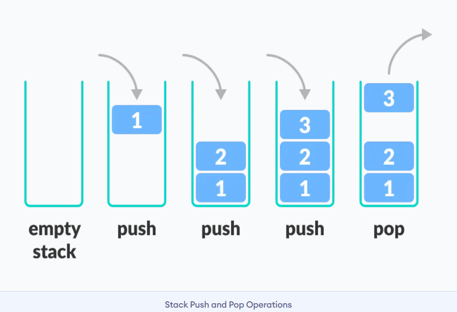
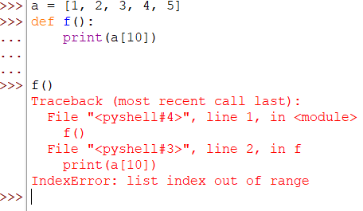

# Python Call Stack

The call stack is how a program tracks what's being called.
It's named after the stack data structure.



Stacks are "Last in First Out" (LIFO). The element added to the stack last will be popped out first. Similarly, the element added first will be popped out last.

Let's see how this applies to function calls:

```python
def a():
    b()

def b():
    print("Hello World!")
a()
```

* First, a gets called
  * call stack: bottom [a] top
* Then, b gets called
  * call stack: bottom [a, b] top
* Then, print gets called
  * call stack: bottom [a, b, print] top

* print finishes running and we go back to b
  * call stack: bottom [a, b] top
* b finishes running and we go back to a
  * call stack: bottom [a] top
* a finishes running
  * call stack: bottom [] top

We can use the call stack to find and debug errors.
For example, in the following code a function tries to access an index that's out of bounds for a list.



From this message, we know that the error itself is an "list index out of range" error. We can follow the call stack back to see what both what called it and what caused it.

In line 2, we can see that print(a[10]) attempts to access a[10], which is out of bounds for list a, which has a length of 5. To fix this error, we could change the 10 to a 4 so that it accesses the last element properly.

Following stack trace further, we can see that the original function call causing this error is f().
